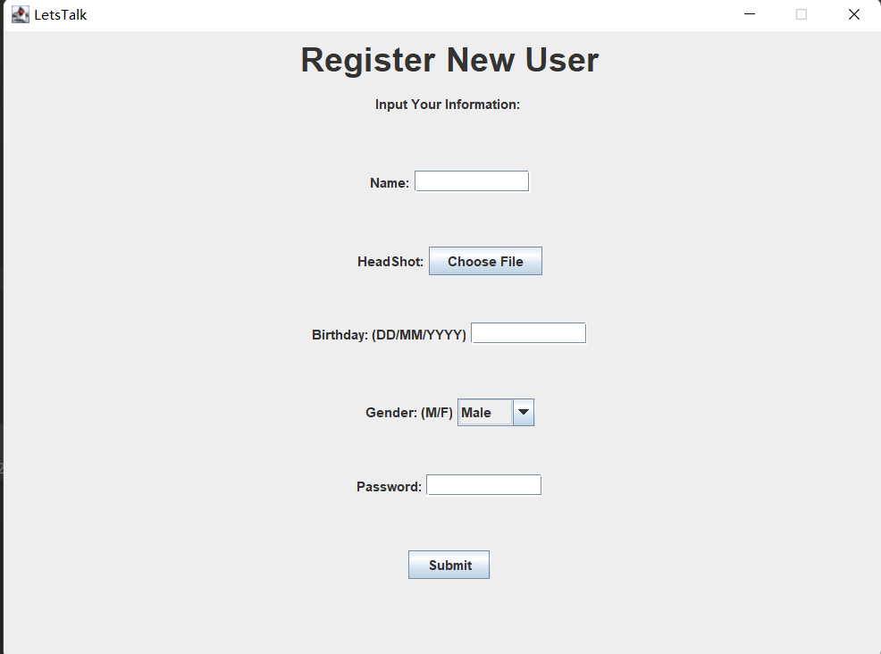
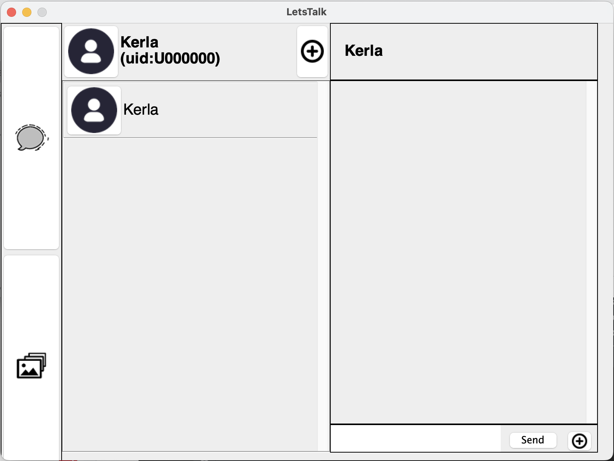
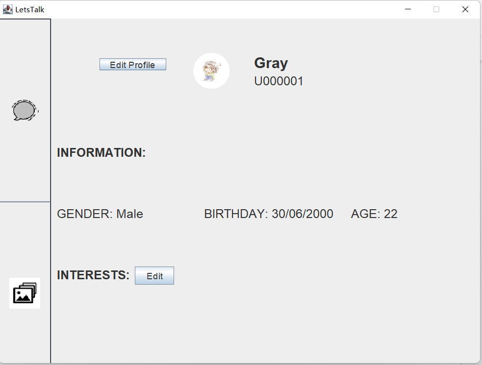
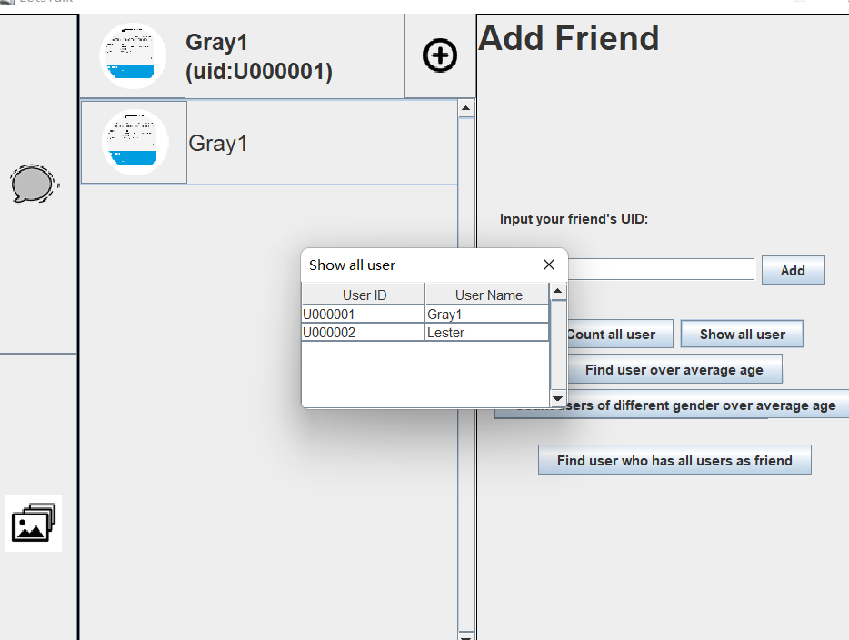
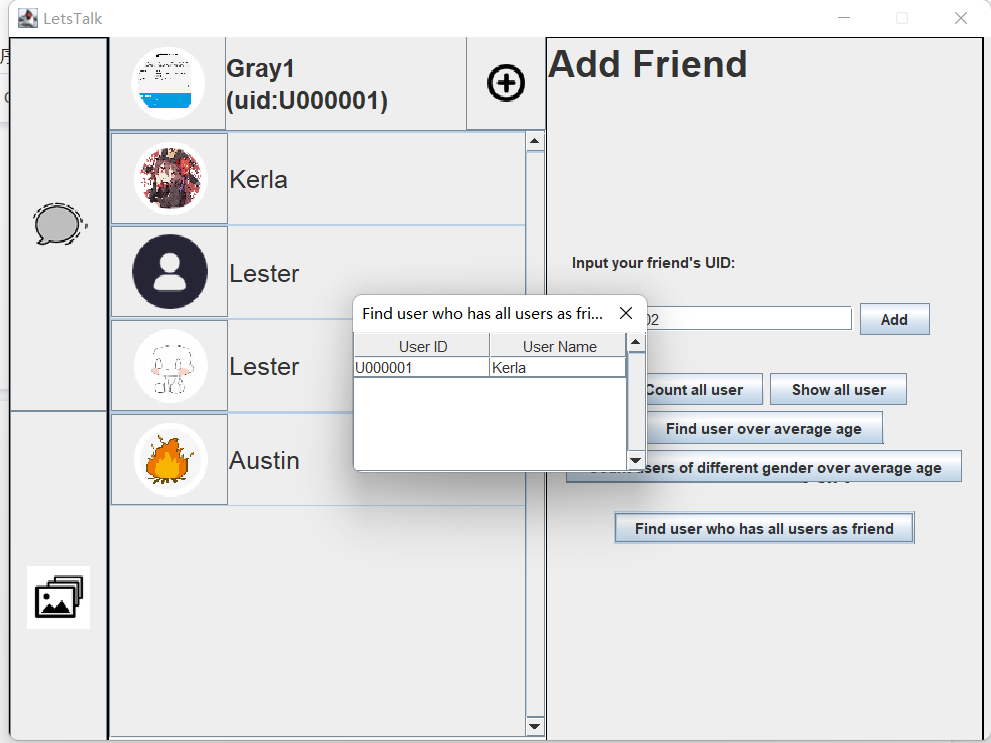
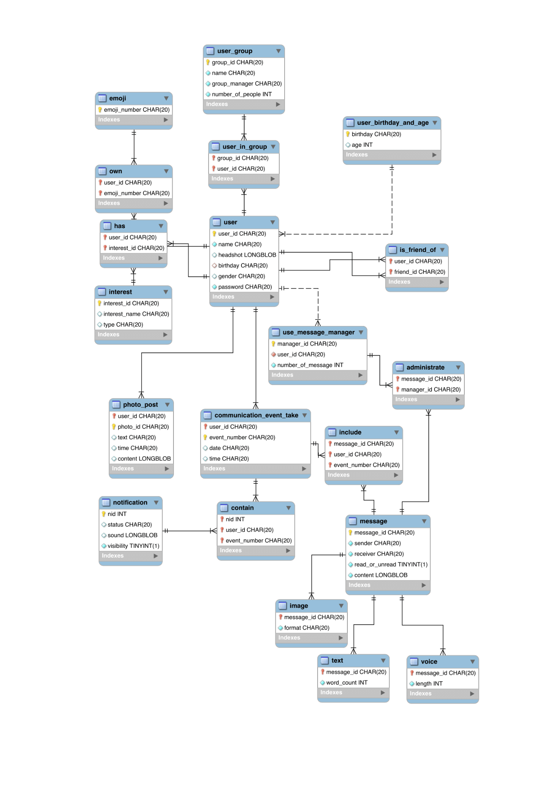

# LetsTalk

LetsTalk is a Java Swing desktop chat and photo-sharing application backed by a MySQL relational database. It was originally built as an SFU CMPT 354 database systems project and has been organized here as an interview-ready portfolio project: the repository includes the application source code, database scripts, ERD/report artifacts, and a concise guide for explaining the design in interviews.

## Project Highlights

- Desktop social messaging client built with Java Swing.
- MySQL-backed data model for users, friendships, groups, messages, emojis, notifications, and photo posts.
- JDBC data access layer with prepared statements for core read/write flows.
- Multi-format message support: text messages, image messages, emoji insertion, and a placeholder flow for voice messages.
- Photo album workflow with image upload, BLOB storage, and per-user photo retrieval.
- Background message refresh thread that keeps the active chat panel updated.
- Packaged Maven build that creates an executable jar with dependencies.

## Tech Stack

| Layer | Technology |
| --- | --- |
| UI | Java Swing |
| Application | Java 8, Maven |
| Persistence | JDBC |
| Database | MySQL |
| Media handling | Java ImageIO, BLOB storage |

## Core Features

- User registration and login
- Profile editing with avatar upload
- Friend management and group creation
- One-to-one chat history retrieval
- Text and image message sending
- Emoji ownership and selection
- Photo post upload and browsing
- Analytical SQL queries used for project reporting, such as average user age by gender and users with complete friendship coverage

## Application Walkthrough

The original project report includes UI screenshots and usage notes. Key screens are extracted into `document/screenshots` so the project can be understood quickly without running the desktop app first.

| Registration | Chat Workspace |
| --- | --- |
|  |  |
| New users enter profile details, choose a headshot image, select gender, and submit to create a database-backed account. | The main chat view combines navigation, friend selection, conversation history, message input, and attachment actions. |

| Profile And Friendship | Friend Discovery |
| --- | --- |
|  |  |
| Users can view profile information, interests, birthday, age, and friendship actions from the profile panel. | The add-friend panel demonstrates database-backed user lookup and reporting-style queries from the course requirements. |

| Group / Relationship Query | ERD |
| --- | --- |
|  |  |
| Group and relationship workflows show how users, friends, and shared groups are retrieved from relational tables. | The ERD captures the main schema behind users, messages, groups, photos, notifications, emojis, and relationship tables. |

For the full usage report, see `document/report.pdf`.

## Architecture

The project is organized around three main layers:

- `Panels`: Swing UI screens and interaction flows.
- `JDBC`: database connection and query operations.
- `TableStruture`: Java model classes that map to database tables.

Typical chat flow:

1. `MainPanel` manages the current application state.
2. `ChatSelectPanel` chooses a friend conversation.
3. `ChatPanel` renders messages and sends new messages.
4. `Insert` writes message, text/image subtype, and communication event rows.
5. `Read` loads conversation history and enriches it with sender and timestamp data.
6. `MessageReceiver` refreshes the active conversation periodically.

## Repository Structure

```text
.
+-- src/main/java
|   +-- Constants
|   +-- Helper
|   +-- JDBC
|   +-- Panels
|   +-- TableStruture
|   +-- Thread
|   +-- Main.java
+-- src/main/resources/Image
+-- document
|   +-- LetsTalk Data Script.sql
|   +-- LetsTalk Query List.pdf
|   +-- LetsTalk Tables Script.pdf
|   +-- LetsTalkERD.pdf
|   +-- report.pdf
|   +-- screenshots
+-- pom.xml
+-- LetsTalk_Executable.jar
```

## Local Setup

Prerequisites:

- JDK 8 or newer
- Maven
- MySQL 8.x

Create a MySQL database named `letstalk`, recreate the schema from `document/LetsTalk Tables Script.pdf`, then load the seed data from `document/LetsTalk Data Script.sql` if you want the demo records.

Configure the database connection with environment variables:

```powershell
$env:LETSTALK_DB_URL="jdbc:mysql://localhost:3306/letstalk"
$env:LETSTALK_DB_USER="letstalk"
$env:LETSTALK_DB_PASSWORD="your-password"
```

Build and run:

```powershell
mvn clean package
java -jar target/LetsTalk-jar-with-dependencies.jar
```

The repository also includes a prebuilt jar, but rebuilding from source is recommended for review or interview demos.

Security note: database credentials are read from environment variables. Do not commit real database passwords to the repository.

## Demo Script

1. Start the app and log in with a seeded user from the database.
2. Open the friend list and select a conversation.
3. Send a text message and explain how the app inserts rows into `message`, `text`, `include`, and `communication_event_take`.
4. Send an image message and show that media is converted into a BLOB before insertion.
5. Open the photo page and upload a post.
6. Walk through the ERD and explain why messages are modeled with subtype tables for text, image, and voice.

## Interview Talking Points

- Designed a normalized relational schema for a social chat domain.
- Connected a Java Swing desktop app to MySQL through JDBC.
- Implemented CRUD workflows across users, friendships, groups, messages, and photo posts.
- Used prepared statements for user-driven queries and inserts.
- Modeled polymorphic message content through shared `message` rows plus specialized subtype tables.
- Balanced database-system requirements with a working end-to-end UI prototype.

See [INTERVIEW_GUIDE_CN.md](INTERVIEW_GUIDE_CN.md) for a Chinese interview pitch, STAR-style explanation, and likely interview questions.

## Future Improvements

- Add password hashing instead of storing raw passwords.
- Replace polling refresh with WebSocket or server-push messaging.
- Add automated tests around JDBC operations with a local test database.
- Move image resizing and file conversion into a reusable media service.
- Add schema SQL as a plain `.sql` file instead of relying on PDF artifacts.
- Introduce a clearer MVC or service-layer boundary between Swing panels and persistence code.

## Authors

Built by Gray Keng, Kerla Zhou, and Lester Li.
